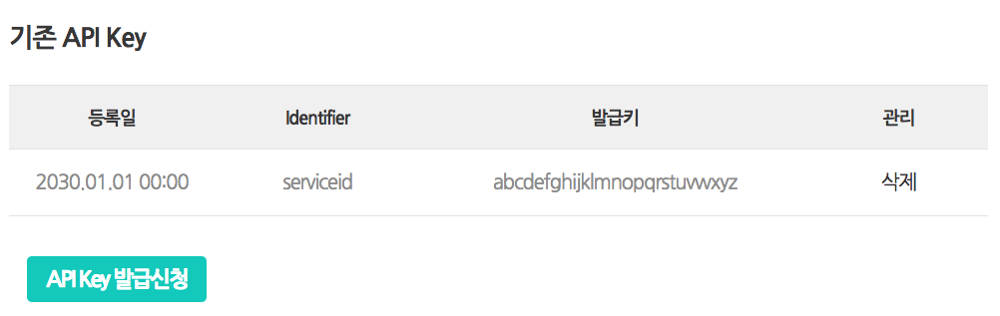

Aligo, SMS
================

[](https://packagist.org/packages/apikr/aligo-sms)
[](https://packagist.org/packages/apikr/aligo-sms)
[](https://packagist.org/packages/apikr/aligo-sms)
[](https://packagist.org/packages/apikr/aligo-sms)

## Installation

```bash
composer require apikr/aligo-sms
```

공식페이지 : [smartsms.aligo.in](https://smartsms.aligo.in/main.html)

## 사용법

1. 서비스를 신청합니다.
2. 관리자에서 "신청/인증" 메뉴에 들어갑니다.
3. "API Key 발급신청" 버튼을 통해 발급받습니다.



4. 발신번호를 추가합니다.

그리고 다음과 같이 정의합니다.

```php
<?php

$httpClient = new GuzzleHttp\Client();

$conf = new Apikr\Aligo\Sms\Configuration([
    'id' => 'serviceid',
    'apikey' => 'abcdefghiklmnopqrstuvwxyz',
    'sender' => '발신번호',
]);
$sms = new Apikr\Aligo\Sms\Api($httpClient, $conf);
```

## 문자전송

```php
<?php
$result = $this->sms->send('000-1234-1234', '문자 가라 얍!');
```

## 문자 잔여량

```php
<?php
$result = $this->sms->remain(); // 한번에 가지고 오기
$result['SMS_CNT']; // sms 남은 갯수
$result['LMS_CNT']; // lms 남은 갯수
$result['MMS_CNT']; // mms 남은 갯수

$this->sms->remainSms();
$this->sms->remainLms();
$this->sms->remainMms();
```

## Exception

- 모든 에러는 `\Apikr\Aligo\Sms\Exception\RequestException` 클래스로 처리합니다.
- 문자 전송은 `\Apikr\Aligo\Sms\Exception\SmsDeliveryException` 클래스로 처리합니다.

```
<?php
namespace Apikr\Aligo\Sms\Exception;

class RequestException extends \RuntimeException
{
    const ERR_SERVER = -100;
    const ERR_INVALID_PARAM = -101;
    const ERR_AUTH_ERROR = -102;
    const ERR_WRONG_SENDER = -103;
    const ERR_DELIVERY_LIMIT_OR_TIME = -105;
    const ERR_INSUFFICIENT_REMAINING = -109;
    const ERR_RESERVED_DATETIME = -115;
    const ERR_REQUIRE_CHARGE = -201;
    const ERR_WRONG_IMAGE = -301;
    const ERR_UNKNOWN = -900;

    public function getResult();
}

class SmsDeliveryException extends RequestException
{
    public function getReceiver();
    public function getText();
}
```
